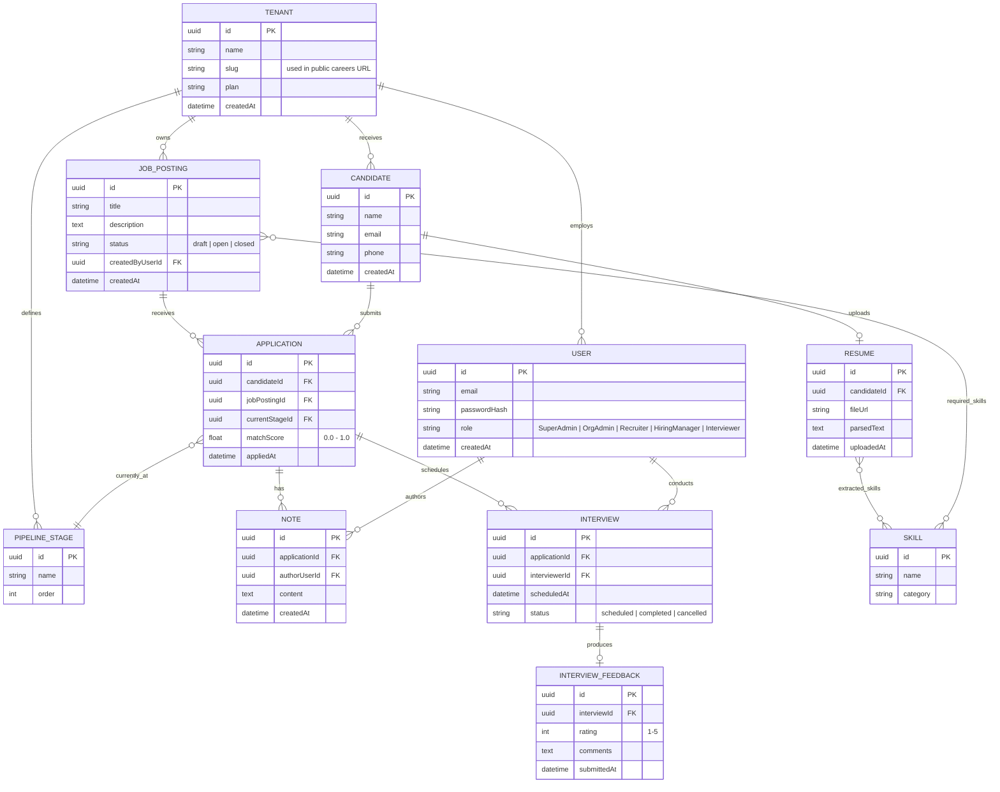

# TalentPipe — Entity Relationship Diagram

**Purpose:** The database entity model as Mermaid ERD + field-level notes. Use this to write Drizzle (PostgreSQL) schemas and migrations. Authoritative data model is mirrored in `00_PROJECT_INSTRUCTIONS.md` §4.

Mermaid ERD syntax below — paste into any Mermaid-compatible viewer (GitHub markdown preview, mermaid.live, your IDE's Mermaid plugin) to render it visually.

> **Canonical source:** `00_PROJECT_INSTRUCTIONS.md` supersedes this doc. Where they differ, follow `00_PROJECT_INSTRUCTIONS.md`.



## Notes on Key Design Decisions

**`USER` has no `tenantId` column.** Role membership (OrgAdmin, Recruiter, etc.) is implicitly scoped by which schema the user's row exists in. SuperAdmin users live in the `public` schema and are authorized purely by role, not by tenant schema membership — this is the one deliberate exception, and it should be the only one. Guard SuperAdmin routes by role check alone.

**`SKILL` lives in the `public` schema** (shared across all tenants). It's a shared taxonomy across the whole platform (e.g. "React", "SQL", "Project Management") so skill matching and search work consistently. Tenant-specific custom skills are a reasonable v2 addition but add complexity — start with a shared list.

**Join tables** (not drawn above for brevity, but required in the actual schema): `resume_skills` (resumeId, skillId) and `job_required_skills` (jobPostingId, skillId) implement the many-to-many relationships shown as `}o--o{` above.

**`APPLICATION.matchScore`** is denormalized (computed once at application time and stored, not calculated on every read) — recompute it via a background job if the job posting's required skills change after applications already exist.

**No table carries `tenantId`** — isolation is provided by the PostgreSQL schema boundary, not by a column. Each tenant's tables live in their own schema (e.g. `tenant_abc123.job_postings`). The `SKILL` table lives in the `public` schema as a shared taxonomy. When implementing, write an automated test that asserts a query in Tenant A's schema cannot reach Tenant B's schema.

## Isolation Is Enforced at the Schema Level, Not Just in App Code

Each tenant's data lives in its own PostgreSQL schema. This provides physical namespace isolation — tables in schema A are invisible to queries in schema B. No composite FKs or `tenant_id` columns are needed. 

When provisioning a new tenant, the system creates a schema and clones the table structure from a template:
```sql
CREATE SCHEMA tenant_abc123;
CREATE TABLE tenant_abc123.job_postings (LIKE template_schema.job_postings INCLUDING ALL);
-- repeat for all tenant-scoped tables
```

All queries for that tenant then run with `SET search_path TO tenant_abc123, public` — PostgreSQL automatically resolves unqualified table names to the tenant's schema.

See `05_DATA_ISOLATION_STRATEGY.md` for the full defense-in-depth approach this schema decision is part of.
