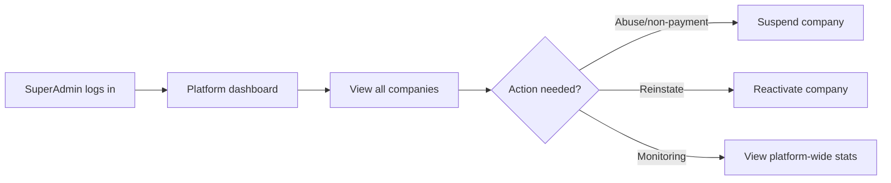
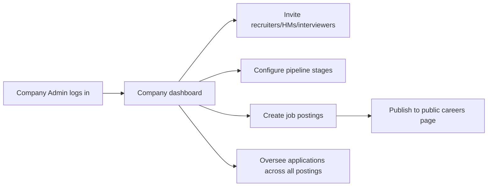
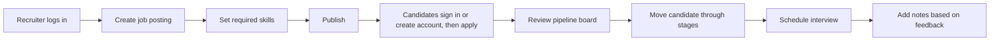
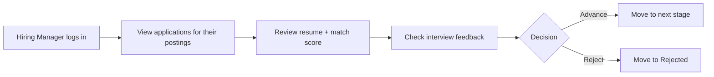
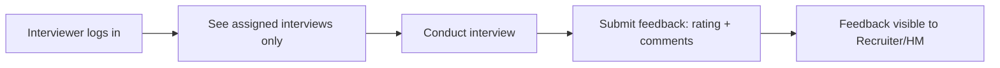
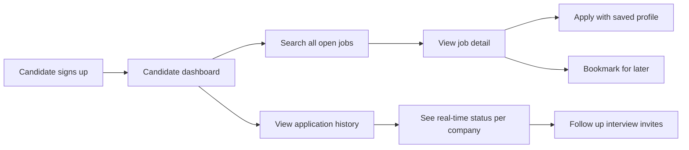

# TalentPipe — Role Interactions (Frontend & Backend)

**Purpose:** Defines the six roles, the permission matrix, and per-role frontend/backend behavior flowcharts. Use this to implement both the frontend `beforeLoad` route guards and the backend authorization checks consistently. Authoritative role rules are mirrored in `00_PROJECT_INSTRUCTIONS.md` §6.

Six roles: **SuperAdmin, Company Admin, Recruiter, Hiring Manager, Interviewer, Candidate.** SuperAdmin is platform-level (no company); the other four internal roles belong to exactly one company; Candidate is an authenticated global account holder with a personal dashboard (application history, bookmarks, profile).

> **Canonical source:** `00_PROJECT_INSTRUCTIONS.md` supersedes this doc. Where they differ, follow `00_PROJECT_INSTRUCTIONS.md`.

**Data note (resolved):** Interview feedback is a **separate `INTERVIEW_FEEDBACK` table** joined 1:1 to `Interview` (per `04_ERD_DIAGRAM.md`), submitted via `POST /interviews/:id/feedback`. It is not a plain field on `Interview`.

## Permission Matrix

| Capability | SuperAdmin | Company Admin | Recruiter | Hiring Manager | Interviewer | Candidate |
|---|---|---|---|---|---|---|---|
| Manage all companies | ✅ | — | — | — | — | — |
| Manage company users, per-user suspend, candidates, applications & interviews cross-company | ✅ | — | — | — | — | — |
| Manage own company settings | — | ✅ | — | — | — | — |
| Invite/remove users, assign roles | — | ✅ | — | — | — | — |
| Configure pipeline stages | — | ✅ | — | — | — | — |
| Create/edit job postings | — | ✅ | ✅ | — | — | — |
| View candidates & applications | — | ✅ | ✅ | ✅ | — | — |
| Move applications through pipeline | — | ✅ | ✅ | ✅ | — | — |
| Add notes | — | ✅ | ✅ | ✅ | — | — |
| Schedule interviews | — | ✅ | ✅ | ✅ | — | — |
| View own assigned interviews | — | — | — | — | ✅ | — |
| Submit interview feedback | — | — | — | — | ✅ (if assigned) | — |
| Browse public job listings (works unauthenticated via `/public/*`) | — | — | — | — | — | ✅ |
| Submit an application after Candidate authentication | — | — | — | — | — | ✅ |
| View own application history | — | — | — | — | — | ✅ |
| Bookmark/save jobs | — | — | — | — | — | ✅ |
| Manage profile | — | — | — | — | — | ✅ |
| Login to candidate account | — | — | — | — | — | ✅ |

## Permission Presets (M18)

Roles remain the anchor for routing/context, but each internal account's **effective permissions** come from the **permission preset** assigned to it (`users.preset_id`; `NULL` = the role's default preset). Presets can only ever **restrict** a role, never grant beyond its default — the ceiling rule. Design: `docs/superpowers/specs/2026-08-12-permission-management-design.md`.

**Catalog (17 keys, single source of truth = `ROLE_PERMISSIONS` in `common/permissions/permissions.ts`):** the ✅ columns below are the seeded default preset per role; SuperAdmin is not in the catalog (nothing controls SuperAdmin) and Candidate is out of scope.

| Permission | CA | Recruiter | Hiring Mgr | Interviewer |
|---|:-:|:-:|:-:|:-:|
| `jobs.view` | ✅ | ✅ | ✅ | — |
| `jobs.create_edit` | ✅ | ✅ | — | — |
| `jobs.publish_close` | ✅ | ✅ | — | — |
| `jobs.delete` | ✅ | — | — | — |
| `candidates.view` | ✅ | ✅ | ✅ | — |
| `candidates.manage` | ✅ | ✅ | — | — |
| `applications.view` | ✅ | ✅ | ✅ | — |
| `applications.move` | ✅ | ✅ | ✅ | — |
| `applications.note` | ✅ | ✅ | ✅ | — |
| `interviews.view` | ✅ | ✅ | ✅ | ✅ (assigned) |
| `interviews.schedule` | ✅ | ✅ | ✅ | — |
| `interviews.feedback` | — | — | — | ✅ (assigned) |
| `stages.manage` | ✅ | — | — | — |
| `settings.manage` | ✅ | — | — | — |
| `users.manage` | ✅ | — | — | — |
| `permissions.manage` | ✅ | — | — | — |
| `dashboard.view` | ✅ | ✅ | ✅ | ✅ |

**Preset model:** default presets (one per internal role) are seeded read-only in the public schema (Duplicate only); SuperAdmin manages **global presets** (public schema, full CRUD, available to every company); CompanyAdmin manages **company presets** (company schema, full CRUD, own company only). CSV exports ride on their resource's view permission.

**Hierarchy rules:**

1. **SuperAdmin** — full control: global preset CRUD, preset assignment for every account in every company (incl. CompanyAdmins), sees company presets read-only.
2. **CompanyAdmin** — preset CRUD scoped to own company; assignment only for Recruiter / HiringManager / Interviewer accounts in own company (403 on CA targets, 404 on other companies' users). Requires own `permissions.manage` (always in the CA default).
3. **Ceiling rule** — a preset's permissions are always a subset of its bound role's default (`permissions ⊆ ROLE_PERMISSIONS[role]`, validated server-side, 400 on violation); assignment requires the preset's role to **match the user's role** (400 otherwise).
4. **Lockout safety** — a CompanyAdmin's `permissions.manage` / `users.manage` can only be removed by assigning a CA preset lacking them, which only SuperAdmin can do (CA cannot assign to CA accounts).
5. **Role change resets the preset** to the new role's default preset.

**Enforcement:** `@Permissions('permission.key', ...)` decorator + global `PermissionsGuard` stacks **after** `@Roles(...)` — role check passes first, the permission guard narrows. The guard resolves the user's effective set per request (preset join, no cache): `preset_id` set → `preset.permissions`; else `ROLE_PERMISSIONS[role]`. SuperAdmin bypasses. The effective set is also mirrored as a `permissions` claim in the JWT access token (SuperAdmin/Candidate get `[]`).

## 1. SuperAdmin

**Frontend:** `/admin/*` route tree, separate `PlatformShell` layout (not the company dashboard). Sees `CompaniesPage` (platform stats cards + company table), `CompanyDetail` (usage counts + suspend/reactivate + **Users / Applications / Interviews tabs**), and `CandidatesPage` (cross-company candidate table with create/edit/delete).
**Backend:** Authorized by role check only — `@Roles('SuperAdmin')` on `/platform/*` handlers (global `RolesGuard`). The `CompanyContextInterceptor` maps a SuperAdmin identity to `companyId: 'public'`, so `getSchema()` returns `'public'` and platform repos use `withDb('public', ...)` — SuperAdmin never routes through a company schema. Usage counts read explicit `company_<id>` schemas via `forSchema` (cross-schema reporting is the one sanctioned exception).
**Suspend semantics (M9):** a suspended company's users get `403` at sign-in and `401` on refresh rotation (existing 15-minute access tokens expire); public careers return `404`. Suspend/reactivate write audit rows (`company.suspend` / `company.reactivate`) attributed to the target company.
**Account management (M11):** SuperAdmin can create/update/remove company users (`/platform/companies/:id/users*`), suspend/reactivate **individual users** via `users.status` (same sign-in `403` / refresh `401` enforcement; `409` on same-state double-action; audit rows `platform.user.create|update|suspend|reactivate|remove`), and create/update/delete candidates across companies (`/platform/candidates*` — delete cascades company applications + `candidate_applications_index` + the linked candidate account; audit `platform.candidate.*`). Cross-company operations on applications and interviews (`/platform/applications*`, `/platform/interviews*`) follow the same 404-for-foreign-resource convention; stage moves sync `candidate_applications_index` (rollback + `503` on sync failure) and write `platform.application.stage_move` / `platform.interview.update` audit rows targeting the company.

## 2. Company Admin

**Frontend:** Full internal dashboard under `/company/*` (`CompanyPlatform` layout) plus company settings (`/company/settings`) and user management (`/company/users`) — sidebar links rendered for CompanyAdmin only. Pipeline stage editor remains future work.
**Backend:** `companyId` derived from JWT; authorized for all Company Admin-marked routes within that company only. User-management actions (invite, role change, remove) write audit rows; self-change/self-remove and demoting the last CompanyAdmin are rejected with `403`.

## 3. Recruiter

**Frontend:** Job postings CRUD, candidate list, pipeline board, notes, interview scheduling.
**Backend:** Company-scoped; authorized for job-posting, candidate, application, note, and interview endpoints — not company/user management.

## 4. Hiring Manager

**Frontend:** Read/act on applications and pipeline for postings relevant to their team; interview feedback visibility; cannot create job postings (v1 assumption — adjust if your scope differs).
**Backend:** Same company-scoped authorization tier as Recruiter for applications/interviews; excluded from job-posting create/edit if you want that distinction enforced (optional, confirm against your own scope decision).

## 5. Interviewer

**Frontend:** Scoped view — only sees interviews assigned to them (`/interviews?assignedToMe=true`), submits feedback forms. No access to full candidate list, job postings, or company settings.
**Backend:** `GET /interviews` for an Interviewer is implicitly filtered to `interviewerId = current user` at the query layer, not just hidden in the UI — enforce this server-side, since a UI-only restriction is not real access control.

## 6. Candidate (authenticated, global account)

**Frontend:** pathless `_candidate` route tree (`CandidatePlatform` layout, minimal chrome, no AppShell sidebar) serving `/dashboard`, `/applications`, `/bookmarks`, `/settings`. Logged-in candidates have a dashboard showing all open jobs across companies, application history with real-time statuses, and bookmarked/saved jobs.

**Backend:** JWT with `role: 'Candidate'` and no `companyId`. All `/candidate/*` routes are guarded with `@Roles('Candidate')` (global `RolesGuard`) + `AuthGuard('jwt')`. Operates in the public schema — company data is accessed via cross-schema index tables (`job_listings_index`, `candidate_applications_index`).

**Auth:** Candidates sign up via the unified `POST /api/auth/signup` and sign in via `POST /api/auth/signin` (no separate `/auth/candidate/*` routes).

**Public careers/apply flow:** Public GET routes expose company-specific open jobs and details. An anonymous Apply action redirects to unified sign-in/signup with a safe return path. Authenticated Candidates use `/candidate/jobs/:companyId/:jobId/apply` (implemented); no anonymous application or resume record is created.

## Key Enforcement Reminder

Every non-SuperAdmin, non-Candidate role check above has **two layers**: the frontend `beforeLoad` route guard (hides UI the user shouldn't see) and the backend authorization check (actually blocks the request). The frontend layer is for UX only — the backend layer is what makes it secure. Never rely on the frontend guard alone; write a backend test per role that asserts a forbidden action returns 403, not just that the button is hidden.

Candidate accounts are a special case — they live in the public schema and have no companyId. Their role is 'Candidate' and they are authenticated but operate outside the company context. The global `RolesGuard` (`@Roles('Candidate')`) protects `/candidate/*` routes; the `CompanyContextInterceptor` maps them to the `public` schema via `getSchema()`.
