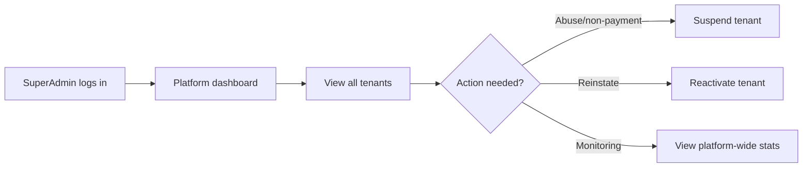
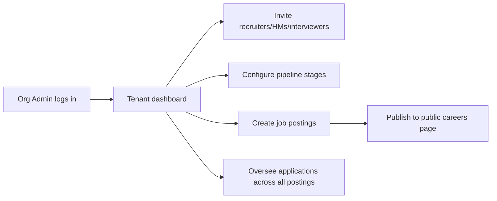
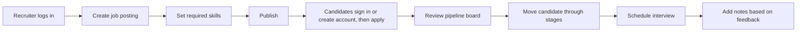
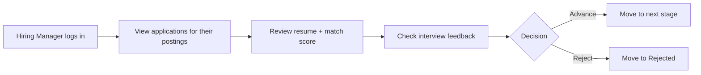
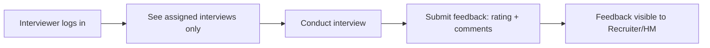

# TalentPipe — Role Interactions (Frontend & Backend)

**Purpose:** Defines the six roles, the permission matrix, and per-role frontend/backend behavior flowcharts. Use this to implement both the frontend `beforeLoad` route guards and the backend authorization checks consistently. Authoritative role rules are mirrored in `00_PROJECT_INSTRUCTIONS.md` §6.

Six roles: **SuperAdmin, Org Admin, Recruiter, Hiring Manager, Interviewer, Candidate.** SuperAdmin is platform-level (no tenant); the other four internal roles belong to exactly one tenant; Candidate is an authenticated global account holder with a personal dashboard (application history, bookmarks, profile).

> **Canonical source:** `00_PROJECT_INSTRUCTIONS.md` supersedes this doc. Where they differ, follow `00_PROJECT_INSTRUCTIONS.md`.

**Data note (resolved):** Interview feedback is a **separate `INTERVIEW_FEEDBACK` table** joined 1:1 to `Interview` (per `04_ERD_DIAGRAM.md`), submitted via `POST /interviews/:id/feedback`. It is not a plain field on `Interview`.

## Permission Matrix

| Capability | SuperAdmin | Org Admin | Recruiter | Hiring Manager | Interviewer | Candidate |
|---|---|---|---|---|---|---|
| Manage all tenants | ✅ | — | — | — | — | — |
| Manage own tenant settings | — | ✅ | — | — | — | — |
| Invite/remove users, assign roles | — | ✅ | — | — | — | — |
| Configure pipeline stages | — | ✅ | — | — | — | — |
| Create/edit job postings | — | ✅ | ✅ | — | — | — |
| View candidates & applications | — | ✅ | ✅ | ✅ | — | — |
| Move applications through pipeline | — | ✅ | ✅ | ✅ | — | — |
| Add notes | — | ✅ | ✅ | ✅ | — | — |
| Schedule interviews | — | ✅ | ✅ | ✅ | — | — |
| View own assigned interviews | — | — | — | — | ✅ | — |
| Submit interview feedback | — | — | — | — | ✅ (if assigned) | — |
| Browse public job listings (works unauthenticated via `/public/*`) | — | — | — | — | — | ✅ |
| Submit an application after Candidate authentication | — | — | — | — | — | ✅ |
| View own application history | — | — | — | — | — | ✅ |
| Bookmark/save jobs | — | — | — | — | — | ✅ |
| Manage profile | — | — | — | — | — | ✅ |
| Login to candidate account | — | — | — | — | — | ✅ |

## 1. SuperAdmin

**Frontend:** `/admin/*` route tree, separate `PlatformShell` layout (not the tenant dashboard). Sees `TenantsPage` (platform stats cards + tenant table), `TenantDetail` (usage counts + suspend/reactivate).
**Backend:** Authorized by role check only — `@Roles('SuperAdmin')` on `/platform/*` handlers (global `RolesGuard`). The `TenantContextInterceptor` maps a SuperAdmin identity to `tenantId: 'public'`, so `getSchema()` returns `'public'` and platform repos use `withDb('public', ...)` — SuperAdmin never routes through a tenant schema. Usage counts read explicit `tenant_<id>` schemas via `forSchema` (cross-schema reporting is the one sanctioned exception).
**Suspend semantics (M9):** a suspended tenant's users get `403` at sign-in and `401` on refresh rotation (existing 15-minute access tokens expire); public careers return `404`. Suspend/reactivate write audit rows (`tenant.suspend` / `tenant.reactivate`) attributed to the target tenant.

## 2. Org Admin

**Frontend:** Full internal dashboard under `/org/*` (`OrgPlatform` layout) plus org settings (`/org/settings`) and user management (`/org/users`) — sidebar links rendered for OrgAdmin only. Pipeline stage editor remains future work.
**Backend:** `tenantId` derived from JWT; authorized for all Org Admin-marked routes within that tenant only. User-management actions (invite, role change, remove) write audit rows; self-change/self-remove and demoting the last OrgAdmin are rejected with `403`.

## 3. Recruiter

**Frontend:** Job postings CRUD, candidate list, pipeline board, notes, interview scheduling.
**Backend:** Tenant-scoped; authorized for job-posting, candidate, application, note, and interview endpoints — not org/user management.

## 4. Hiring Manager

**Frontend:** Read/act on applications and pipeline for postings relevant to their team; interview feedback visibility; cannot create job postings (v1 assumption — adjust if your scope differs).
**Backend:** Same tenant-scoped authorization tier as Recruiter for applications/interviews; excluded from job-posting create/edit if you want that distinction enforced (optional, confirm against your own scope decision).

## 5. Interviewer

**Frontend:** Scoped view — only sees interviews assigned to them (`/interviews?assignedToMe=true`), submits feedback forms. No access to full candidate list, job postings, or org settings.
**Backend:** `GET /interviews` for an Interviewer is implicitly filtered to `interviewerId = current user` at the query layer, not just hidden in the UI — enforce this server-side, since a UI-only restriction is not real access control.

## 6. Candidate (authenticated, global account)

**Frontend:** pathless `_candidate` route tree (`CandidatePlatform` layout, minimal chrome, no AppShell sidebar) serving `/dashboard`, `/applications`, `/bookmarks`, `/settings`. Logged-in candidates have a dashboard showing all open jobs across tenants, application history with real-time statuses, and bookmarked/saved jobs.

**Backend:** JWT with `role: 'Candidate'` and no `tenantId`. All `/candidate/*` routes are guarded with `@Roles('Candidate')` (global `RolesGuard`) + `AuthGuard('jwt')`. Operates in the public schema — tenant data is accessed via cross-schema index tables (`job_listings_index`, `candidate_applications_index`).

**Auth:** Candidates sign up via the unified `POST /api/auth/signup` and sign in via `POST /api/auth/signin` (no separate `/auth/candidate/*` routes).

**Public careers/apply flow:** Public GET routes expose tenant-specific open jobs and details. An anonymous Apply action redirects to unified sign-in/signup with a safe return path. Authenticated Candidates use `/candidate/jobs/:tenantId/:jobId/apply` (implemented); no anonymous application or resume record is created.

## Key Enforcement Reminder

Every non-SuperAdmin, non-Candidate role check above has **two layers**: the frontend `beforeLoad` route guard (hides UI the user shouldn't see) and the backend authorization check (actually blocks the request). The frontend layer is for UX only — the backend layer is what makes it secure. Never rely on the frontend guard alone; write a backend test per role that asserts a forbidden action returns 403, not just that the button is hidden.

Candidate accounts are a special case — they live in the public schema and have no tenantId. Their role is 'Candidate' and they are authenticated but operate outside the tenant context. The global `RolesGuard` (`@Roles('Candidate')`) protects `/candidate/*` routes; the `TenantContextInterceptor` maps them to the `public` schema via `getSchema()`.
